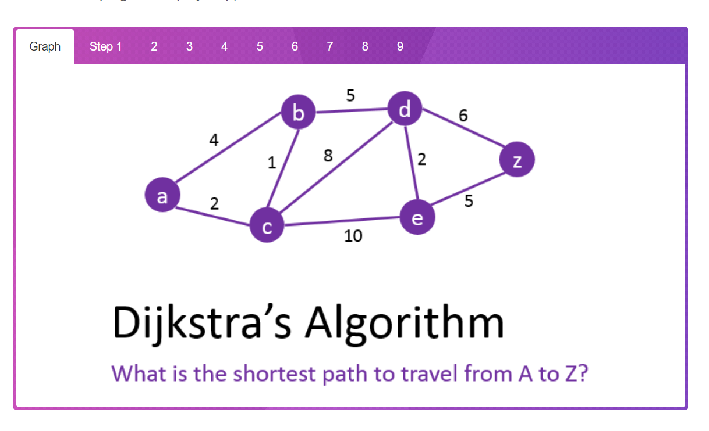

Task: Solve shortest path with adjacency list and adjacency matrix using Dijkstra Algorithm

Answer: 

So the Shortest Path from A-Z is:
A – C – B – D – Z with a length of 14

Answer: 
 
The shortest path from Home to office is:

Home - A - C - E - Office with weight of 14